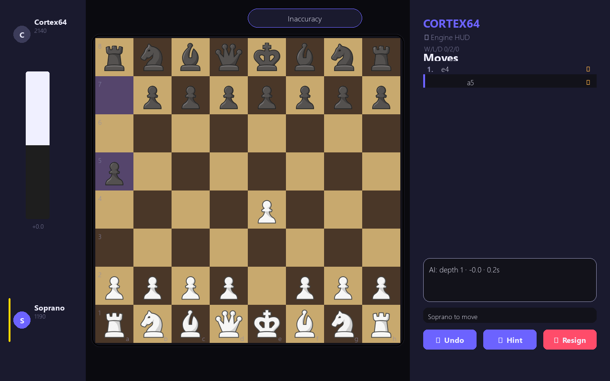
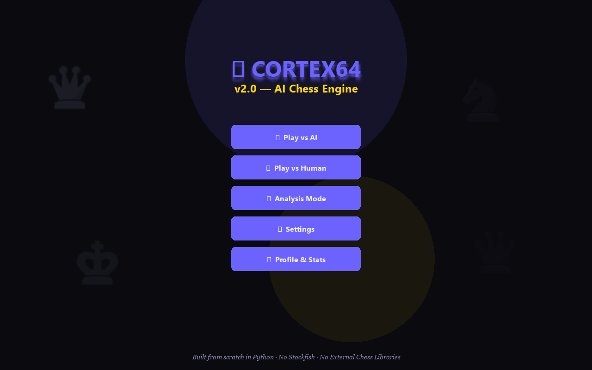
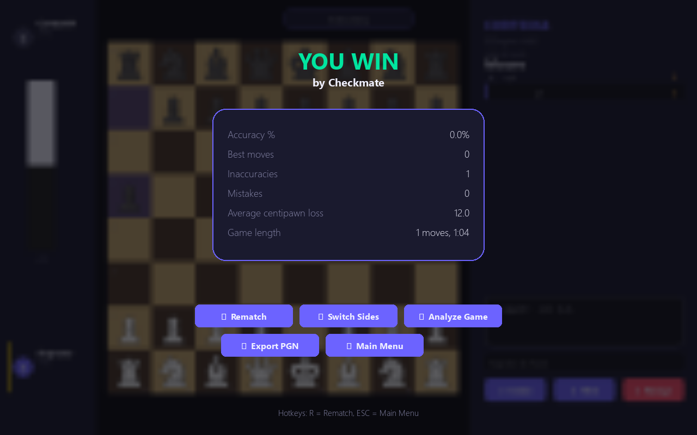
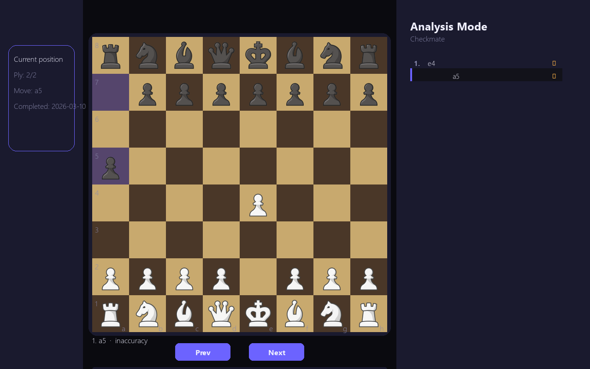
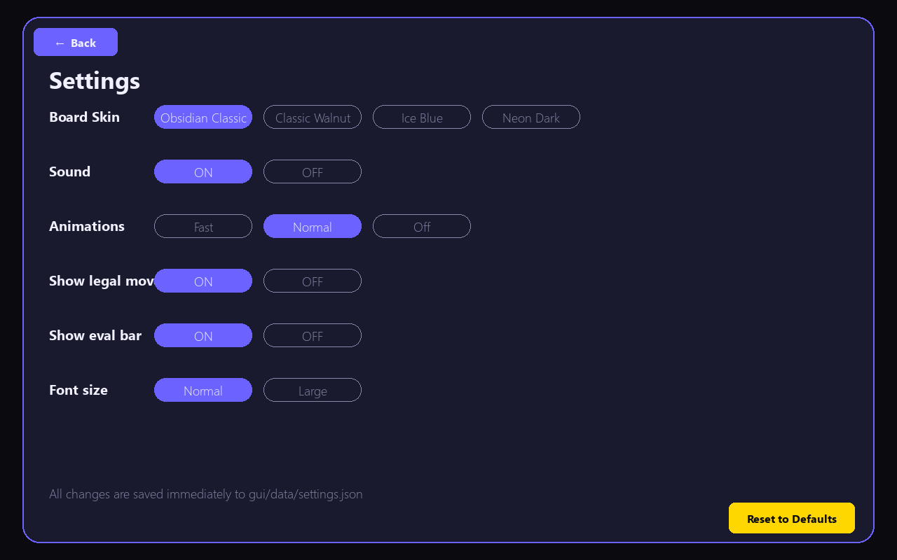

<div align="center">

# ⬡ Cortex64

### AI Chess Engine — Built from scratch in Python


**Cortex64 is a desktop AI chess application built entirely from scratch in Python.**
No Stockfish. No python-chess. No external chess engines. Everything — the move
generator, the AI search, the GUI — is hand-written.



</div>

---

## What's New in v2.0

| Feature | v1 | v2 |
|---|---|---|
| Main Menu | ❌ | ✅ Full animated main menu |
| Board Skin | Grey flat | ✅ Obsidian Classic (warm oak + walnut) |
| Animations | ❌ | ✅ Piece slide, shake, check pulse |
| Evaluation Bar | ❌ | ✅ Live centipawn bar |
| Chess Clock | ❌ | ✅ With increment support |
| Difficulty | CLI flag only | ✅ In-app slider (5 levels) |
| Move Quality | ❌ | ✅ ✓ △ ✗ badges per move |
| Results Screen | Basic popup | ✅ Full stats + accuracy % |
| Analysis Mode | Basic | ✅ Eval graph + engine arrows |
| Settings | ❌ | ✅ Skin, sound, animation toggles |
| Drag & Drop | ❌ | ✅ |
| Sound | ❌ | ✅ Move, capture, check, illegal |

---

## Screenshots

### Main Menu


### Game in Progress


### Post-Game Results


### Analysis Mode


### Settings


---

## Features

### Engine (unchanged from v1 — battle-tested)
- Full legal move generation (castling, en passant, promotion)
- Check, checkmate, stalemate detection
- Reversible board state (`push` / `pop`)
- Negamax + alpha-beta pruning with move ordering
- Depth ceiling and time-bounded search
- CNN-based evaluator (PyTorch) — falls back to material/positional if no model

### GUI — v2 (complete overhaul)
- **Multi-screen architecture** — MainMenu → GameSetup → Game → Results → Analysis
- **Obsidian Classic board skin** — warm oak light squares, dark walnut dark squares
- **Smooth piece animations** — 120ms ease-out slide on every move
- **Illegal move shake** — board shakes instead of silent failure
- **Check pulse** — king square flashes red when in check
- **Evaluation bar** — smooth vertical bar with live centipawn label
- **Chess clock** — countdown with increment, danger flash under 30s
- **Move quality badges** — ✓ good / △ inaccuracy / ✗ mistake per half-move
- **Accuracy stat** — computed at end of game
- **Eval sparkline** — evaluation graph in analysis mode
- **Drag & drop** — click-to-move and drag-and-drop both supported
- **Sound effects** — move, capture, check, illegal, game end
- **4 board skins** — Obsidian Classic, Classic Walnut, Ice Blue, Neon Dark
- **Settings persistence** — all preferences saved to `gui/data/settings.json`

---

## Quick Start

```bash
# Clone
git clone https://github.com/vivekyarra/cortex64-chess-engine.git
cd cortex64-chess-engine

# Create virtual environment
python -m venv .venv

# Activate (macOS/Linux)
source .venv/bin/activate

# Activate (Windows PowerShell)
.\.venv\Scripts\Activate.ps1

# Install dependencies
pip install -r requirements.txt

# Run
python main.py
```

---

## Run with CLI Options

```bash
# Skip menu, start directly with specific settings
python main.py --depth 8 --move-time 2.0 --human white

# Play as Black at Master difficulty
python main.py --depth 12 --move-time 3.0 --human black

# Use a trained CNN model
python main.py --model ai/models/chess_cnn.pt
```

| Argument | Description | Default |
|---|---|---|
| `--depth` | Maximum search depth | Uses in-app slider |
| `--move-time` | AI move time budget (seconds) | Uses in-app slider |
| `--human` | Your color: `white` or `black` | Uses in-app selector |
| `--model` | Path to CNN model weights | Falls back to material eval |

---

## Controls

### Gameplay
| Input | Action |
|---|---|
| Left-click piece | Select piece (shows legal moves) |
| Left-click destination | Move selected piece |
| Click-hold + drag | Drag and drop piece |
| Q / R / B / N | Promote pawn to chosen piece |
| ESC | Clear selection / close popup |
| R | Quick rematch (on results screen) |

### Sidebar Buttons
| Button | Action |
|---|---|
| ↩ Undo | Undo last move (disabled while AI is thinking) |
| 💡 Hint | Show best move arrow + explanation |
| ⚑ Resign | Resign current game (with confirm) |

### Analysis Mode
| Input | Action |
|---|---|
| ← / → arrow keys | Navigate moves |
| Click on eval graph | Jump to that position |
| Click move in list | Jump to that move |

---

## Architecture

```
main.py                     ← entry point, screen router

engine/
  board.py                  ← NumPy board, push/pop
  move_generator.py         ← legal move generation
  minimax.py                ← negamax + alpha-beta

ai/
  model.py                  ← CNN architecture (PyTorch)
  evaluate.py               ← model loading & scoring
  train.py                  ← training pipeline

gui/
  game.py                   ← main game screen
  constants.py              ← colors, sizes, fonts
  theme.py                  ← skin system
  animation.py              ← animation engine
  sound.py                  ← sound manager

  screens/
    main_menu.py
    game_setup.py
    results.py
    analysis.py
    settings.py

  components/
    button.py               ← reusable Button (hover glow)
    eval_bar.py             ← evaluation bar
    clock.py                ← chess clock
    move_list.py            ← scrollable move list with badges
    player_card.py          ← player info card
    eval_graph.py           ← sparkline eval chart

  assets/
    pieces/                 ← PNG piece images
    sounds/                 ← WAV sound effects
  data/
    profile.json            ← username, stats persistence
    settings.json           ← UI settings persistence
```

---

## Optional: Train the CNN Evaluator

```bash
python -m ai.train --samples 4000 --epochs 5
# Output: ai/models/chess_cnn.pt
```

If no model file exists, Cortex64 falls back to material + positional scoring.

---

## Difficulty Levels

| Level | Depth | Move Time | Style |
|---|---|---|---|
| Beginner | 2 | 0.5s | Makes frequent errors |
| Casual | 4 | 1.0s | Plays reasonable moves |
| Intermediate | 6 | 1.5s | Solid club player level |
| Advanced | 8 | 2.0s | Challenging for most players |
| Master | 12 | 3.0s | Strong positional play |

---

## Requirements

- Python 3.11+
- Windows / macOS / Linux (display required for Pygame)
- Dependencies: `numpy`, `pygame-ce`, `torch`

---

## Design Principles

- **No external engines** — every chess rule implemented from scratch
- **No python-chess** — move generation is fully custom
- **Clean separation** — engine/ai/gui are fully independent layers
- **Educational focus** — hints, move quality feedback, analysis mode
- **Time-bounded AI** — strict wall-time control prevents UI blocking

---

## Troubleshooting

**Missing dependency**
```bash
pip install -r requirements.txt
```

**CNN model missing**
The application runs using material/positional fallback evaluation automatically.

**Pygame display error on Linux**
```bash
export DISPLAY=:0
python main.py
```

**Slow PyTorch install**
```bash
pip install torch --index-url https://download.pytorch.org/whl/cpu
```

---

## Changelog

### v2.0.0 — UI/UX Overhaul
- Complete multi-screen architecture
- Obsidian Classic board skin
- Piece slide animations, board shake, check pulse
- Evaluation bar, chess clock, eval graph
- Move quality badges and accuracy scoring
- Drag-and-drop support
- Sound effects
- Settings screen with skin selection

### v1.0.0 — Initial Release
- Custom chess engine (negamax + alpha-beta)
- Pygame GUI
- CNN evaluator with fallback
- Undo, Hint, Resign, PGN export
- Profile persistence

---

<div align="center">
Built with ♟ by vivekyarra · No Stockfish · No python-chess · Just Python
</div>
