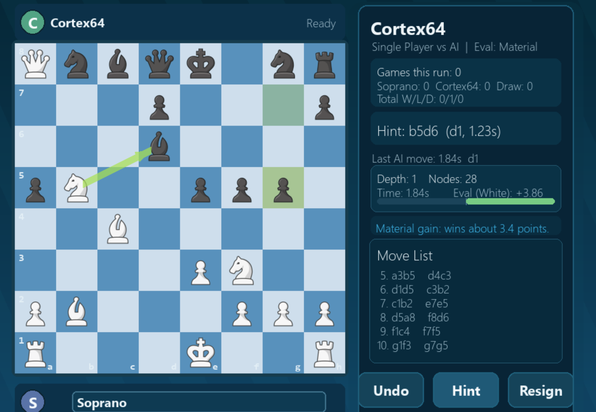

# Cortex64

## Demo



Cortex64 is a local desktop AI chess application built entirely from scratch in Python.

It combines:
- A custom chess engine (no `python-chess`, no Stockfish)
- Negamax search with alpha-beta pruning
- Optional PyTorch CNN-based evaluation
- A Pygame-based desktop GUI focused on learning and analysis

Cortex64 is designed as a training-oriented AI opponent rather than a competitive engine clone.

---

## Features

### Engine
- Full legal move generation
  - Castling
  - En passant
  - Promotion
- Check, checkmate, stalemate detection
- Reversible board state (`push` / `pop`)
- Negamax + alpha-beta pruning
- Move ordering
- Depth ceiling and time-bounded search

### Evaluation
- CNN-based evaluator (PyTorch) when model file exists
- Fast material/positional fallback when weights are missing
- Evaluation exposed in GUI (white perspective)

### GUI & Product Features
- Side selection at game start (White / Black)
- Automatic board flip when playing Black
- Piece image rendering (with fallback drawing)
- Highlights:
  - Selected square
  - Legal targets
  - Last move
  - Hint arrow
- Undo / Hint / Resign / Rematch
- Scrollable move list with clipping
- Rule-based hint explanation:
  - Material gain
  - Threat detection
  - King safety guidance
- Post-move feedback:
  - Good move
  - Inaccuracy
  - Mistake
- AI stats panel:
  - Depth reached
  - Nodes searched
  - Evaluation score
  - Last AI move time
- Post-game popup:
  - Result + reason
  - Move-quality summary
  - Rematch flow
  - Analyze Game mode
  - Export PGN

### Analysis Mode
- Step through moves (Left / Right arrow keys)
- View evaluation swing
- See engine alternative (1-ply)
- Return to post-game screen

### Persistence & Export
- Local profile persistence:
  - Username
  - Games played
  - Wins / losses / draws
  - Preferred side
- Stored in `gui/data/profile.json`
- PGN export folder: `gui/exports/`

---

## Architecture Overview

Cortex64 follows a clean separation of concerns.

### Engine Layer (`engine/`)
- `board.py`
  - Board representation (NumPy)
  - Move application and reversal
- `move_generator.py`
  - Legal move generation
  - Check state detection
- `minimax.py`
  - Negamax
  - Alpha-beta pruning
  - Node counting
  - Depth tracking

This layer contains no GUI logic.

### AI Layer (`ai/`)
- `model.py` — CNN architecture
- `evaluate.py` — model loading & scoring
- `train.py` — random position training pipeline

If model weights are missing, evaluation safely falls back to material scoring.

### GUI Layer (`gui/`)
- `game.py`
  - Pygame loop
  - Rendering
  - Input handling
  - Hint system
  - Feedback
  - Analysis mode
  - Persistence
  - PGN export

AI search runs asynchronously with strict wall-time control to prevent UI blocking.

---

## Requirements

- Python 3.11+
- Windows / macOS / Linux
- Display environment for Pygame

Dependencies (`requirements.txt`):
- `numpy`
- `pygame`
- `torch`

---

## Clone the Repository
1.git clone https://github.com/vivekyarra/cortex64-chess-engine.git
2.cd Cortex64
3.python3 -m venv .venv
4.source .venv/bin/activate   # macOS/Linux
# OR
.\.venv\Scripts\Activate.ps1  # Windows PowerShell

5.pip install -r requirements.txt
6.python main.py


## Setup

### 1) Create virtual environment

Windows PowerShell:

```powershell
python -m venv .venv
.\.venv\Scripts\Activate.ps1
```

macOS / Linux:

```bash
python3 -m venv .venv
source .venv/bin/activate
```

### 2) Install dependencies

```bash
pip install -r requirements.txt
```

If PyTorch installation is slow or fails:

```bash
pip install torch --index-url https://download.pytorch.org/whl/cpu
```

---

## Run

Basic:

```bash
python main.py
```

With options:

```bash
python main.py --depth 12 --move-time 1.8 --human white --model ai/models/chess_cnn.pt
```

CLI arguments:
- `--depth` maximum search depth
- `--move-time` AI wall-time budget (seconds)
- `--human` white or black
- `--model` path to CNN model
- `--window-size` accepted but GUI layout is fixed internally

---

## Optional: Train the CNN

```bash
python -m ai.train --samples 4000 --epochs 5
```

Model output:
- `ai/models/chess_cnn.pt`

---

## Controls

### Gameplay
- Left-click piece to select
- Left-click destination to move
- Promotion keys: `Q` / `R` / `B` / `N`
- `Esc` clears selection or exits popups

### Sidebar
- Undo
- Hint
- Resign

### Move List
- Scroll using mouse wheel inside panel

### End-Game Popup
- Rematch (Continue / Switch Side)
- Analyze Game
- Export PGN
- Close
- Hotkey `R` triggers rematch

### Analysis Mode
- Left / Right arrow keys
- Or Prev / Next buttons
- Back returns to post-game popup

---

## Project Structure

```text
main.py

engine/
  board.py
  move_generator.py
  minimax.py

ai/
  model.py
  evaluate.py
  train.py

gui/
  game.py
  assests/pieces/
  data/
  exports/
```

---

## Design Goals

- No external chess engines
- Deterministic engine behavior
- Clean engine / GUI separation
- Educational focus over raw engine strength
- Time-bounded AI for stable UX

---

## Troubleshooting

### Missing dependency
Activate virtual environment and reinstall:

```bash
pip install -r requirements.txt
```

### CNN model missing
Application runs using material fallback evaluation.

### Slow first install
PyTorch wheels are large; initial download may take several minutes.
